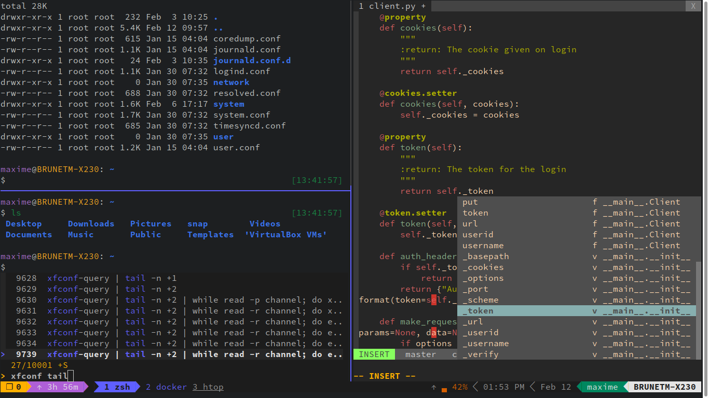

# NaxOS

My [NixOS](https://nixos.org) configuration.



## Bootstrap

> **Warning**
>
> All data will be erased to install NixOS! These instructions are not indented for any users but myself (@maxbrunet), read scripts carefully!

Download and boot the [NixOS installer](https://nixos.org/download.html#nixos-iso), then:

```shell
sudo -i
wpa_passphrase <ESSID> | tee /etc/wpa_supplicant.conf
wpa_supplicant -B -i wlp3s0 -c /etc/wpa_supplicant.conf
nix-env -iA nixos.git
git clone https://github.com/maxbrunet/naxos.git
cd naxos
./bootstrap.sh
# Change TTY (not tty1) or reboot and login
sudo nix-channel --add https://github.com/NixOS/nixos-hardware/archive/master.tar.gz nixos-hardware
sudo nix-channel --add https://nixos.org/channels/nixos-unstable nixos-unstable
sudo nix-channel --update
/etc/nixos/bootstrap-user.sh
```

If running in VirtualBox, ensure:

* EFI is enabled
* 3D acceleration is enabled
* Solid-state Drive is checked for the virtual disk
* The following variables are exported before starting `sway` (e.g. set from `~/.zshenv`):

  ```shell
  export WLR_NO_HARDWARE_CURSORS=1
  export LIBGL_ALWAYS_SOFTWARE=1
  ```
