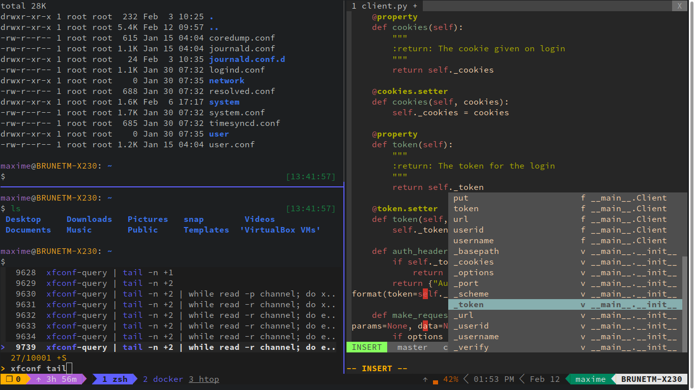

# My Awesome Dotfiles

My dotfiles collection for a flawless workflow. Starring `zsh`, `nvim`, `zellij`, and [NixOS](https://nixos.org).



## Bootstrapping NixOS

> [!WARNING]
>
> All data will be erased to install NixOS! These instructions are not indented for any users but myself (**@maxbrunet**), read scripts carefully!

1. Download and boot the [NixOS installer](https://nixos.org/download.html#nixos-iso)
2. If using WiFi, connect to it:

   ```shell
   wpa_passphrase <ESSID> | sudo tee /etc/wpa_supplicant.conf
   sudo wpa_supplicant -B -i wlp3s0 -c /etc/wpa_supplicant.conf
   ```

3. Run bootstrap script:

   ```shell
   sudo -i
   nix-env -iA nixos.git
   git clone https://github.com/maxbrunet/dotfiles.git
   cd dotfiles
   ./scripts/bootstrap.sh <HOSTNAME>
   reboot
   ```

4. Generate SSH key:

   ```shell
   /etc/nixos/scripts/generate-ssh-key.sh
   ```

5. Install Rust toolchain:

   ```shell
   rustup toolchain install stable --component rust-analyzer
   ```

> [!NOTE]
>
> If running in VirtualBox, ensure:
>
> - EFI is enabled
> - 3D acceleration is enabled
> - Solid-state Drive is checked for the virtual disk

## Bootstrapping macOS

> At least it is not Windows.

1. Install [Nix](https://nixos.org/download.html#nix-install-macos)
2. Log out and log back in to load the new shell profiles installed by Nix (possibly restart)
3. Install the dotfiles:

   ```shell
   sudo mkdir /etc/nix-darwin
   sudo chown "${UID}:${GID}" /etc/nix-darwin
   # Git is not installed, so curl and tar are used to get a copy of the repository
   curl --proto '=https' --tlsv1.2 -sSfL https://github.com/maxbrunet/dotfiles/archive/HEAD.tar.gz \
     | tar xvf - --strip-components=1 -C /etc/nix-darwin
   cd /etc/nix-darwin
   ```

4. Prepare system for `nix-darwin`:

   ```shell
   sudo mv /etc/bashrc /etc/bashrc.orig
   sudo mv /etc/shells /etc/shells.orig
   sudo mv /etc/zshrc /etc/zshrc.orig
   sudo mv /etc/nix/nix.conf /etc/nix/nix.conf.orig
   ```

6. Install [Command Line Tools for Xcode](https://developer.apple.com/documentation/xcode/installing-the-command-line-tools/#Install-the-Command-Line-Tools-package-in-Terminal) (required by Homebrew)

   ```shell
   xcode-select --install
   ```

5. Install [Rosetta](https://support.apple.com/en-ca/102527):

   ```shell
   softwareupdate --install-rosetta --agree-to-license
   ```

6. Install [nix-darwin](https://daiderd.com/nix-darwin/):

   ```shell
   nix --extra-experimental-features 'flakes nix-command' build ".#darwinConfigurations.$(scutil --get LocalHostName).system"
   ./result/sw/bin/darwin-rebuild switch
   ```

7. Change login shell to Nix's Zsh:

   ```shell
   chsh -s /run/current-system/sw/bin/zsh maxime
   ```

8. Log out and log back in to load the new shell profiles installed by nix-darwin (possibly restart)

9. Git should now be available, fetch the Git tracking data:

   ```shell
   cd /etc/nix-darwin
   git init
   git remote add --fetch origin https://git@github.com/maxbrunet/dotfiles.git
   git reset origin/HEAD
   git remote set-url origin git@github.com:maxbrunet/dotfiles.git
   ```

   ```

10. Configure SSH client:

   ```shell
   ssh-keygen -t ed25519 -a 100
   cat >>~/.ssh/config <<EOF
   Host *
     SetEnv LC_ALL=C
     UseKeychain yes
   EOF
   ```

11. Set up Podman machine for k3d:

   ```shell
   # https://github.com/k3d-io/k3d/issues/1082
   podman machine ssh bash -e <<EOF
   echo 'Delegate=cpuset' | sudo tee -a /etc/systemd/system/user@.service.d/delegate.conf
   sudo systemctl daemon-reload
   sudo systemctl restart user@\${UID}
   EOF
   ```
